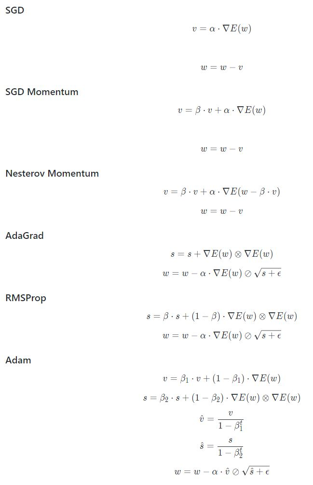

# Visualization of deep learning optimizers

This simulation visualizes gradient descent methods in different situations. The main motivation behind that is to better understand optimizers which are being used by deep learning frameworks.

## Optimizers

All optimizers use the gradient for calculating their next step. In this simulation the gradient is calculated numerically ([symmetric derivative](<[abc](https://en.wikipedia.org/wiki/Symmetric_derivative)>)).

The optimizers use the following formulas to calculate their next step:

## Scenes

### Local minimum

**3D View**

**Top-down view**

### Plateau

**3D View**

**Top-down view**

### Downwards parabola

**3D View**

**Top-down view**

### Hills

**3D View**

**Top-down view**

### Saddle point

**3D View**

**Top-down view**

### 5th degree polynom

**3D View**

**Top-down view**

